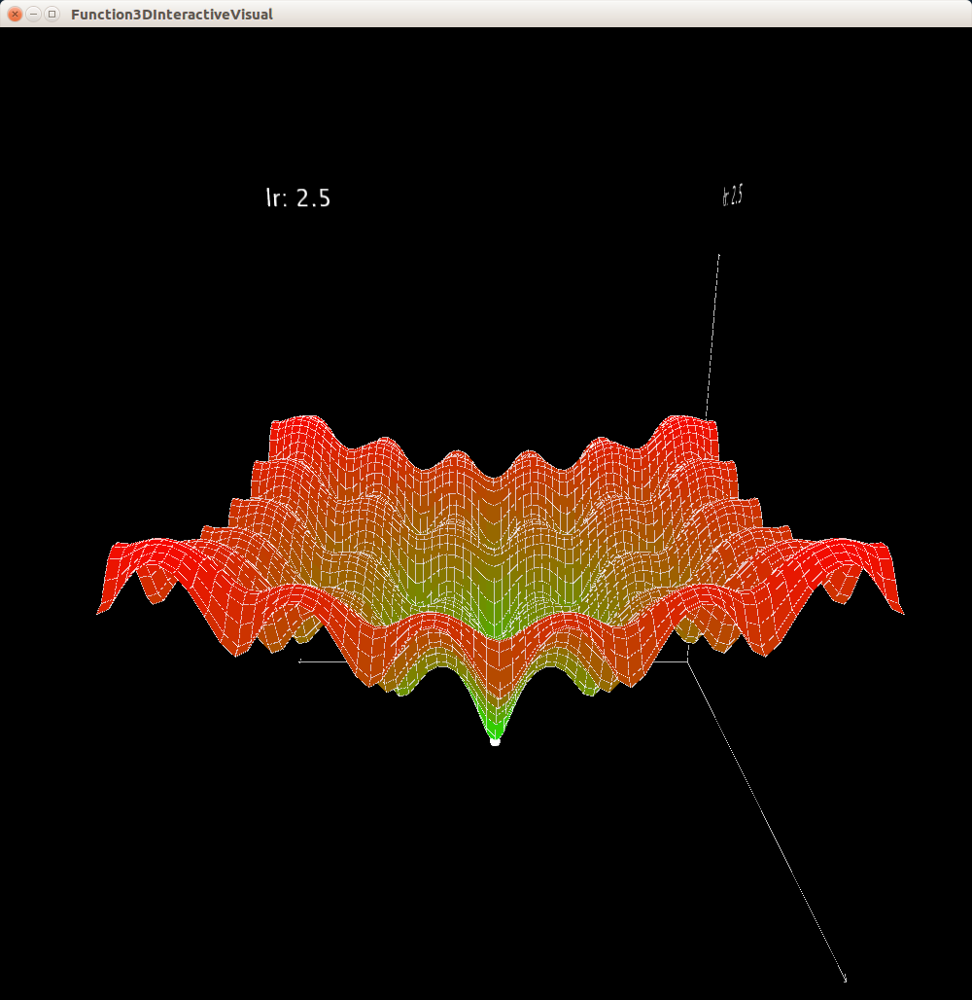
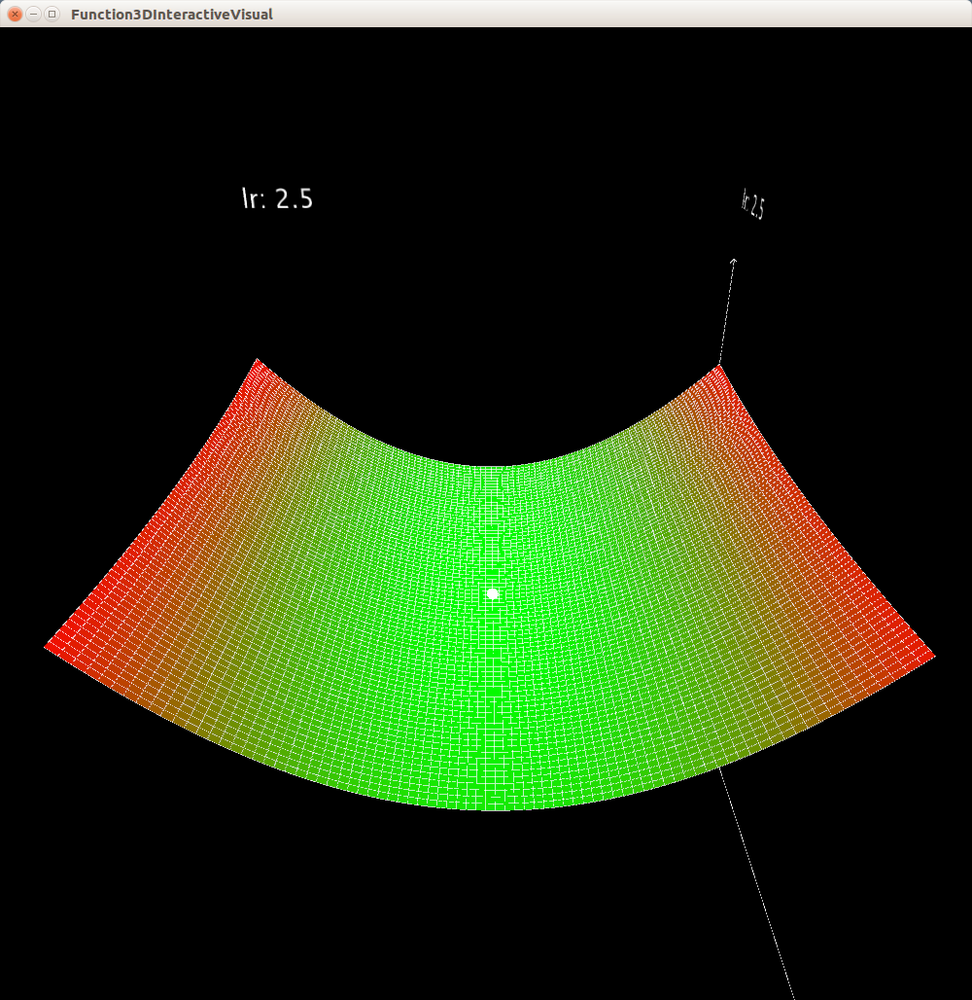
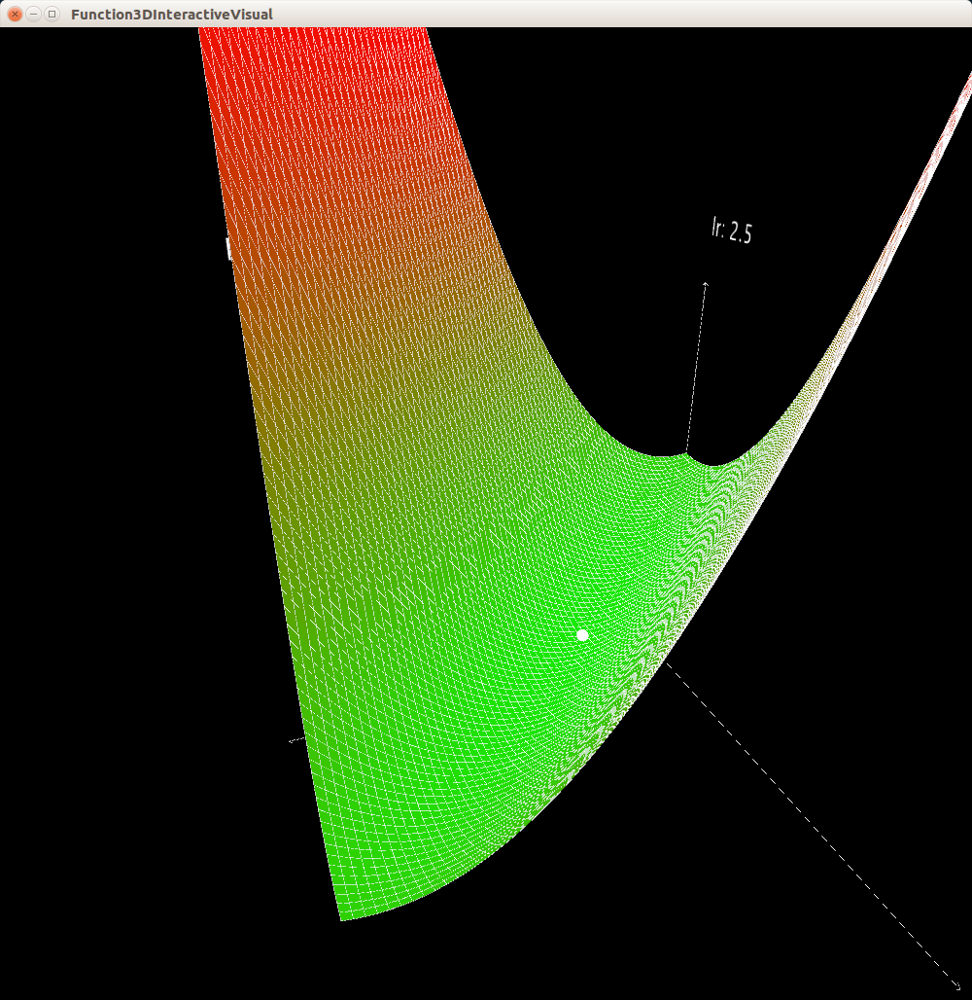
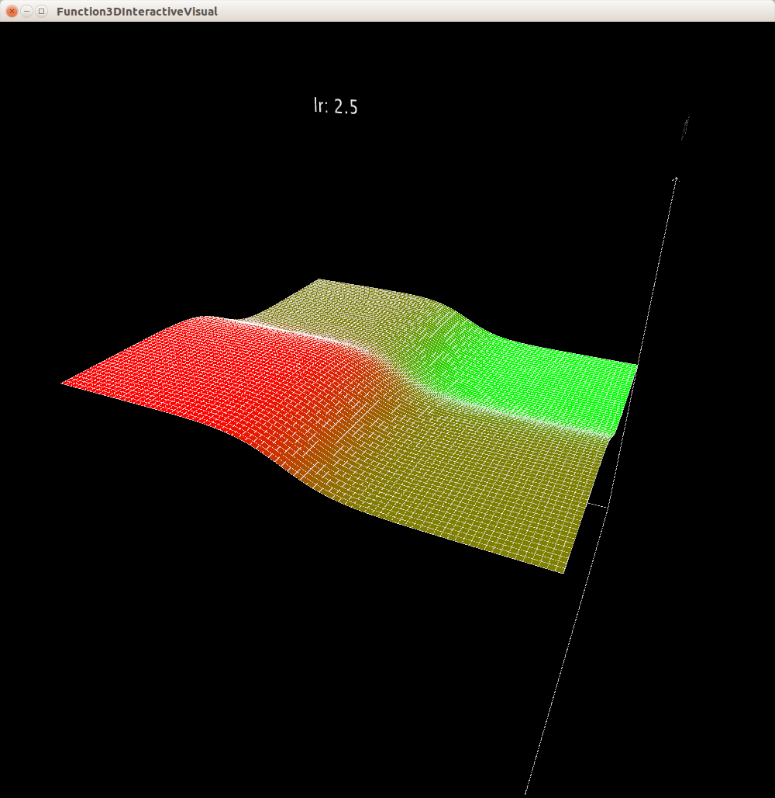
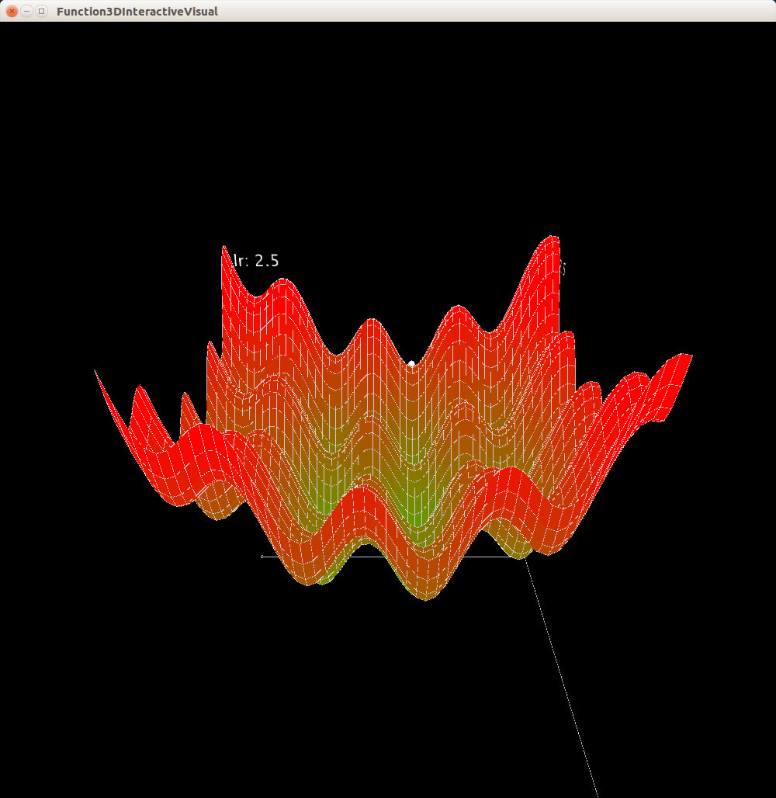
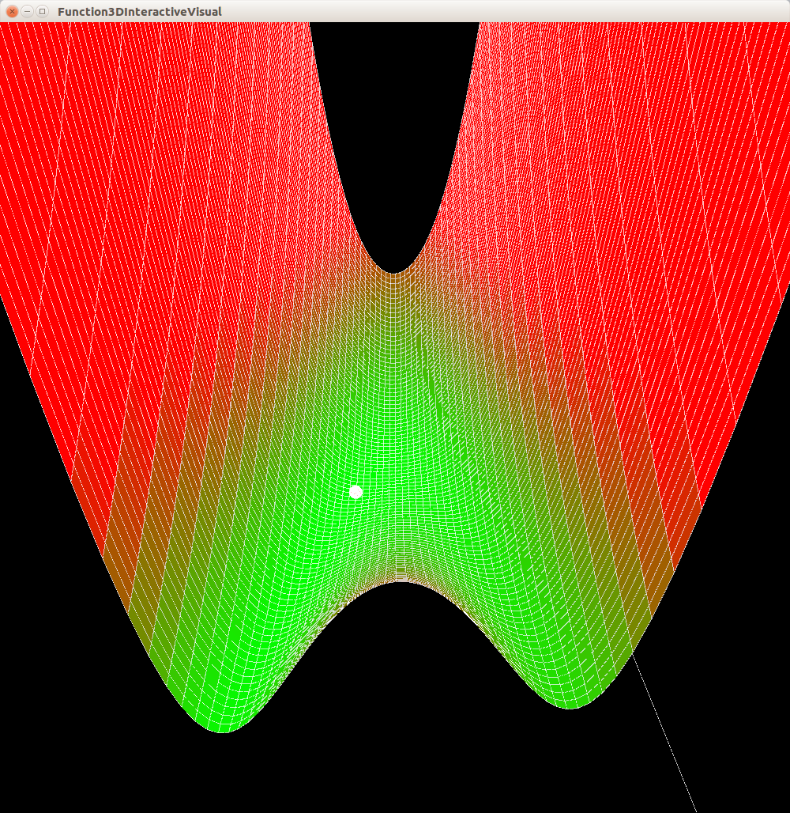

# 3DInteractiveFunctionVisualization
Interactive 3D function visualization made with Processing 

This project offers a 3D gradient optimization and function visualization. 
Using processing it displays a 2D function (in 3D space) and shows how a gradient optimization procedure behaves when optimizing (finding the minimum of the displayed function). 
This is visualized by showing a small white ball on the surface of the function. 
The position of the ball is the current solution and we can observe how to moves in the solution space (on the function surface).

The project supports the following functions: 
* square,
* deceptive,
* multyLocal,
* eliptic,
* sigmoid,
* ackley,
* bananaFunction and
* matyas
To add a new function you need to implement the IFunction interface. 

These can be optimized using the following optimization algorithms: 
* Gradient descent,
* gradient descent with moment,
* gradient descent with changing learning rate,
* gradient descent using nesterov moment,
* AdaGrad,
* RMSProp and 
* Adam.
To add a new optimization algorithm you need to implement the IOptimization interface

You can also select between two coordinate system displays:
* boxed and 
* line. 
The add a new coordinate system you need to implement the ICoordinateSystem interface.

The graph is also interactive. It allows the following interactions: 
* zoom in/out (mouse wheel),
* rotation around z axis (mouse wheel click and drag),
* rotation around x axis (right click and drag),
* translation (left click and drag),
* randomize ball location (R),
* increase the learning rate by 0.001 (+),
* decrease the learning rate by 0.001 (-),
* increase the learning rate by factor 2 (*) and
* decrease the learning rate by factor 2 (/).

## Examples of visualization

Ackely function

Eliptic function

Matyas function

Sigmoid function

Multylocal function

Banana function

